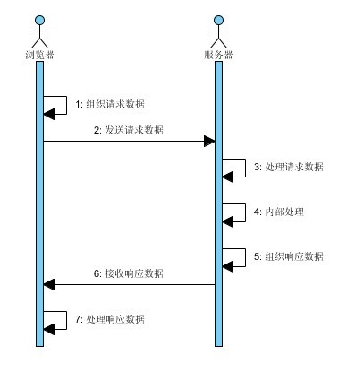

<link rel="stylesheet" href="highlight.js/styles/default.css">

JavaScript概览
==============

课前
---------

* 本文的js实例可以在浏览器的 控制台 直接执行

	* 在chrome中, 直接按f12可打开
	* 在firefox中, f12也可以, 不过推荐安装firebug插件后使用,功能强大很多
	* ie要在ie8及以上, 效果很差

	所以chrome, firefox比较适合做开发

* 对比示例以java为范本, 主要对比对象定义结构的差异
* 假定大家都有编程经验

基于对象
---------

java: 构造出类,再生成实例

	class A{
		public String x = "god";
	}
	A a = new A();

	Object o = new Object();

js: 直接得到对象

	var a = {
		x: 'god'
	};

	var o = {};

所见即所得的方式, 哪里需要写哪里, 直观方便

字面量(literal)
---------

常见的

* 数字: 123 456
* 字符串: 'abc' 'def'
* 布尔值: true false

JavaScript里面更多的

* 对象: {a: 1, b: 'c'}
* 数组: [1, 2, 3]
* 正则: /reg/gim

对于字面量,我们可以直接调用其原型方法:

	alert({a: 1, b: 'c'}.a);
	alert([1, 2, 3][1]);
	alert(/bb/gim.test('abbc'));

特殊的, 数字我们需要加括号或者把它赋给一个变量后使用原型方法,  
在 控制台 报出来的是语法错误, 不过我们可以更进一步理解, 因为JavaScript的语法多样性导致  
因为有些语法在特定情况下会产生歧义, 这种情况下加括号可以解决

	//错误
	3.toFixed(3);
	//正确
	(4).toFixed(3);
	//正确
	var a = 5;
	a.toFixed(3);

弱类型/无类型
---------

java:

	public class A {
		public String a = "sss";
		public static void main(String[] args) {
			//JavaScript的代码相当于这里面的代码, 没有外面的修饰符
			A a = new A();
			String fail = "Fail";
			int i = 3;
		}
	}

JavaScript:

没有类型,又要定义变量,怎么办?

	//没有 A, String, int 这些具体的类型, 我们使用var关键字表示定义变量
	var a = 3;
	alert(typeof a);
	a = 'god';
	alert(typeof a);
	var b = 'c';
	alert(typeof b);
	b = 33.22;
	alert(typeof b);

js代码结构
---------

* 代码执行 - 从上到下, 递归调用
* 作用域链 - 查找变量用

	* 体现递归调用
	* 作用域由函数划分, 代码写好后就已经确定, 而非运行时

			var a = 1;
			function aa(){
				var b = 3;
				function bb(){
					var b = 4
					alert(b);
				}
				bb();
				alert(b);
				alert(a);
			}
			aa();

* 原型链 - 查找属性用

	* 可以模拟继承

			function B(){
			}
			B.prototype.b = 33;
			function A(){
				this.x = '中文';
			}
			A.prototype = new B();
			A.prototype.a = 'hello';

			var a = new A();
			alert(a.x);
			alert(a.a);
			alert(a.b);

			//可以看到有这样一条链
			//a -> A.prototype -> B.prototype

			//我们甚至可以在实例化A之后修改它的原型链,使它有动态的属性
			alert(a.c);
			A.prototype.c = 'this is c';
			alert(a.c);

			//但它会影响到所有的A的实例
			var a1 = new A();
			alert(a1.c);

动态性
---------

* 弱类型赋值已经是一种动态的表现
* 原型链一节中, 修改原型链使已经实例化的对象都可以获得变化

我们现有项目中的代码介绍
---------

* 使用了loader - requirejs

	* 类似于linux下的包管理工具 - 解决以来关系

			文件依赖
			a -> b -> c

	* 能把多个js合并成一个, 相当于link工具

			我们把上面的文件合并成文件d
			file d : 
			c's content
			b's content
			a's content
			因为js按顺序执行,文件d的内容顺序正确,所以依赖被解决了

	* loader附带了optimizer, 能够压缩js,css

		有很多等级: 去掉注释, 去掉空格空行, 替换局部变量...

			//原始方法: length: 169
			function DoSomeOperate(num){
				//增加数量
				var addBy = 20;
				//倍数
				var multiplyBy = 22;
				return (num + addBy) * multiplyBy;
			}
			alert(DoSomeOperate(33));

			//去掉注释,空行: length: 123
			function DoSomeOperate(num){var addBy = 20;var multiplyBy = 22;return (num + addBy) * multiplyBy;}
			alert(DoSomeOperate(33));

			//去掉注释,空格,空行, 替换局部变量: length: 85
			function DoSomeOperate(a){var b=20;var c=22;return (a+b)*c;}alert(DoSomeOperate(33));

		最终的目的就是: 缩短字符,减小文件体积

		因为我们的代码通过web访问, 减小文件体积就是减小流量, 加快加载时间

		所以,当大家看到外网上的js代码乱成一团是,不要以为人家只是为了混淆代码, 更是为了节约资源!

* 与项目解耦合

	* 公共功能放入公共模块,作为基础的实现,工具
	* 特定项目自有的放入对应的目录中,使其不干扰其它的代码

			requirejs
				├── config.js
				├── css
				├── demo
				├── i18n.js
				├── jquery-1.7.1.js
				├── jquery-plugin
				├── kissy.js
				├── md5.js
				├── require.js
				├── swfupload
				├── text.js
				├── ui
				├── underscore.js
				├── util
				├── validator
				└── wad - 群发器项目代码指定目录

	* 这个组织会随着功能的完善和代码的积累而变化, 但是已经比2年前的代码组织有了明显的提升

国际化支持
---------
java 使用资源文件

	//zh_CN:
	key1=值1
	key2=值2

	//en_US:
	key1=value1
	key2=value2

	getText(key);

JavaScript 使用 valueMap

	//en_US:
	值1=value1
	值2=value2

	getText('值1'); 

* 中文下直接返回输入值'值1', 其它语言返回valueMap['值1']
* 可以使用工具提取 /getText\('(.*?)'\)/g 生成 valueMap,
* 每次生成还可以通过工具与上次对比产生增量,只用维护增量
* 上面提到的工具可以是java,python,php, 也可以是nodejs

服务器端js(nodejs) - 脱离了浏览器,js能做什么呢?
---------

* 能操作二进制,能操作文件系统,能调用操作系统api,就能干其它语言能做的事情
* nodejs提供了这一系列api

	[nodejs api](http://nodejs.org/api/index.html)

			About these Docs
			Synopsis
			Assertion Testing
			Buffer
			C/C++ Addons
			Child Processes
			Cluster
			Crypto
			Debugger
			DNS
			Domain
			Events
			File System
			Globals
			HTTP
			HTTPS
			Modules
			Net
			OS
			Path
			Process
			Punycode
			Query Strings
			Readline
			REPL
			STDIO
			Stream
			String Decoder
			Timers
			TLS/SSL
			TTY
			UDP/Datagram
			URL
			Utilities
			VM
			ZLIB

问题排查
---------

### http请求响应时序

因为 浏览器,服务器 2个环境不一样, 不能统一处理问题

如果我们不能明确到底是 浏览器 还是 服务器 出了问题,最简单的就是进行抓包

1. 查看请求数据是否正确
1. 查看响应数据是否正确

然后分别对应不同方面的问题采用不同的方法处理

##### 需要注意几点

1. 开发环境一定要保证没有缓存
1. 不清楚问题原因为采用删减代码的方式, 一半一半的删, 找到分界线的地方基本上就能发现问题所在了

jade模板引擎
---------

[模板引擎 - 百科](http://baike.baidu.com/view/4258079.htm): 模板引擎（这里特指用于Web开发的模板引擎）是为了使用户界面与业务数据（内容）分离而产生的，它可以生成特定格式的文档，用于网站的模板引擎就会生成一个标准的HTML文档。

我们的项目中暂时还没使用到 模板引擎, 如果说有, 那是我们的自定义标签, 但是用户界面与业务数据分离并不彻底

Jade is a high performance template engine heavily influenced by Haml and implemented with JavaScript for node.

一些资源站点

* [Jade](http://jade-lang.com/)
* [Jade Source on github](https://github.com/visionmedia/jade)
* [Jade Syntax Documentation](http://naltatis.github.com/jade-syntax-docs/)

关于本文
---------

本文使用 [markdown](http://daringfireball.net/projects/markdown/) 制作

Markdown is a text-to-HTML conversion tool for web writers. Markdown allows you to write using an easy-to-read, easy-to-write plain text format, then convert it to structurally valid XHTML (or HTML).

开源的东西, 推荐大家使用

本文会放在内网服务器上, 欢迎大家浏览

* [2012.11.2 - JavaScript概览](http://192.168.129.55/lesson/2012.11.2/js.md)

      

谢谢大家
---------

             
